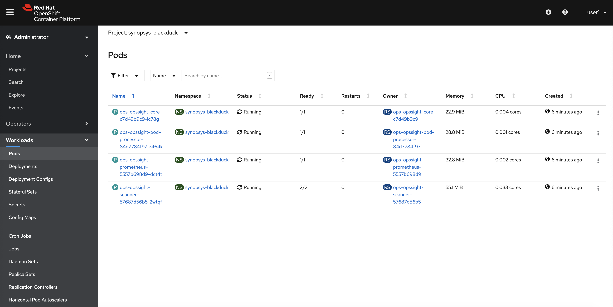
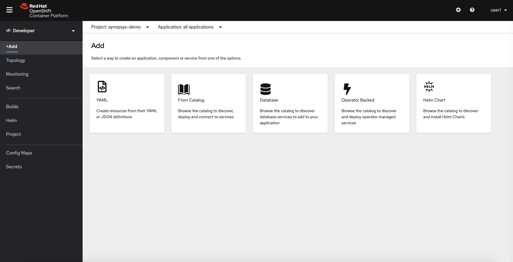

This workshop showcases how to scan containers deployed on Red Hat OpenShift with Synopsys' Software Composition Analysis tool, Black Duck in production workloads. Black Duck provides a solution for managing security, license compliance and code quality risks that come from the use of open source and third-party code in applications and containers.

This workshop demonstrates Black Duck fully deployed and running on OpenShift and will cover the following topics:

1. Black Duck for OpenShift setup.
2. Project & 'pod running' verification.
3. Demo Application details
4. How Black Duck Scanning works.
5. An overview of Black Duck Scanning results.
6. Scanning a custom container.

# Black Duck for OpenShift setup

A lab instructor is required to run this as a workshop. After the instructor deploys the RHPDS instance, it will create a Red Hat OpenShift cluster with two projects created, and Black Duck for OpenShift deployed. The lab instructor will provide participants access to the cluster. To view what was created by the instructor follow these steps:

1. Click on Home (Left navigation panel) > Projects > synopsys-blackduck: to view the Black Duck connector project. To see the running pods navigate to the workloads section on the top.

2. Similarly, to view the scanning demo project, repeat the above process by selecting synopsys-demo


# Project & 'pod running' verification

The two created projects are as follows - synopsys-blackduck & synopsys-demo. The synopsys-blackduck project contains 4 pods:

1. opssight-core: brains of the operation, a pod which communicates with Black Duck instance hosted at <https://redhathub.blackducksoftware.com/>, it maintains a list of all the scanned images and communicates with the rest of the pods.

2. opssight-pod-processor: a pod which connects with other pods and retrieves underlying base image that runs inside the containers in OpenShift.

3. opssight-scanner: a pod which downloads the image from whichever image registry it's supposed to.

4. opssight-prometheus: a pod which monitors opssight's consumption of resources.



This also includes a configmap for configuring a lot of options e.g. when to look for scans to run, only run scans for specific project etc. There are also two opaque secrets created which helps the integration with any images that may come from a private registry. All of these options are preconfigured so workshop users do not need to worry about them.

# Demo Application details

The demo application is an insecure bank application under project the synopsys-demo where users can make dummy bank transactions. The underlying image that's running this application is located at <https://quay.io/repository/opssighttestorg/insecure-bank>. This underlying image will be scanned by Black Duck.

1. To see the running pod of this project navigate to Workloads (left side panel) > Pods > insecure-bank-deployment-{generated-alpha-numerice-code} pod
**Make sure the project (on the top) is set to synopsys-demo before doing this.**

2. Next let's look at a ClusterIP service generated for this app, navigate to Networking (left side panel) > services > insecure-bank, this should validate connection to insecure-bank pod after clicking the pods column on the top.

3. This app is also externally exposed using routes to be interactable, navigate to Networking > Routes > insecure-bank. The external IP should be visible under the location column. The username and password for testing is "john@example.com" and "test" respectively.


# How the scanning works

**Note: For purposes of this workshop, the Black Duck scanner is only configured to scan anything deployed in the synopsys-demo workspace**.

The scanning process works as place as follows:

1. The insecure-bank application is deployed in the cluster.

2. The "connector-pod-processor" pod is informed that there's a new pod in the cluster and it sends underlying image information to the "connector-core" pod.

3. The "connector-core" initiates the scanning process by delivering the information to "connector-scanner" pod while taking a note of the activity & progress.

4. The "connector-scanner" pod then initiates a Black Duck signature scan. There are two containers in the pod, the first (image-getter) container will download and temporarily store the image in memory. The second (scanner) container to invoke the Black Duck scanner.

5. If the image has not been previously scanned, then the scanner will create the project with version. If the image is present with a different version, then the scanner will only create a new version under the project. If both image and the version are present in Black Duck then image is not sent for scanning and the results are re-used.

6. After scanning is finished, Black Duck populates the Bill Of Materials (BOM) in Black Duck.

7. The "connector-core" pod retrieves the information from Black Duck and sends it back to the "connector-pod-processor" pod while taking a note of the scan completion and results received.

8. The "connector-pod-processor" pod will finally annotate the relevant pod with policy violation and vulnerability count.

[More details here](https://synopsys.atlassian.net/wiki/spaces/BDLM/pages/34275718/OpsSight+Architecture)

To view these labels in the OpenShift UI navigate to Workloads (left side panel) > Pods > click on insecure-bank-deployment-{generated-alpha-numerice-code} pod (make sure the project is set to synopsys-demo now) and scroll down to the labels section.


# Overview of Black Duck Scanning results

> :warning: **PLEASE NOTE THAT WE'RE NOT DEMONSTRATING ALL OF BLACK DUCK'S CAPABILITIES HERE. THIS SECTION ONLY HIGHLIGHTS THE PROCESS FOLLOWED IN THIS WORKSHOP**

To view the scanning results in Black Duck UI follow these instructions:

1. Open a new tab in a browser and go to this URL -> https://redhathub.blackducksoftware.com. The username and password are to be given by the instructor.

2. In the project view look for the project labelled "quay.io/opssighttestorg/ducky-crm" and click on it. The version under this project shows the SHA of the image, see screenshot below. Click on the version to proceed.


3. This will open up a Bill of Materials (BOM) view of the specific project version. The components listed are what's present inside that container, they may or may not have security vulnerabilities and policy violations. This view gives a general overview about the container.


4. To get a more security focused view click on the security tab on the upper right side of the screen. This will showcase a more thorough view of each component and vulnerabilities associated with them. This feed of information includes Black Duck Security Advisories (BDSAs) which provide a more complete view of the vulnerabilities, their exploits and workarounds. [Learn more about BDSAs here](https://www.synopsys.com/blogs/software-security/black-duck-security-advisories/).


5. To see a more detailed view of the scanned image and layers that were scanned, view the source tab on the upper right side of the screen.


# Scanning a custom container (Advanced)

> :warning: **PLEASE DON'T SCAN HUGE PROJECTS, THIS BLACK DUCK INSTANCE IS UNDER AN NFR LICENSE AND HAS LIMITED CAPACITY**

The objective is to deploy an application in the synopsys-demo project so that the Black Duck connector can scan it. In the steps below we'll be using the <https://quay.io/repository/opssighttestorg/ducky-crm> image.

1. Go to Developer section (perspective) instead of Administrator view in synopsys-demo project and select the YAML option.



2. Note: Other users may be creating the same application in this project, so it is important to modify the YAML below to use your lab username where [userx] is found. After updating the YAML, paste it into the editor text area and click "Create" to create the Deployment.

``` Yaml
apiVersion: apps/v1
kind: Deployment
metadata:
  name: [userx]-ducky-crm-deployment
  labels:
    app: ducky-crm
spec:
  replicas: 1
  selector:
    matchLabels:
      app: ducky-crm
  template:
    metadata:
      labels:
        app: ducky-crm
    spec:
      containers:
      - name: ducky-crm
        image: quay.io/opssighttestorg/ducky-crm:latest
        ports:
        - containerPort: 80
        resources:
          requests:
            memory: "256Mi"
            cpu: "500m"
          limits:
            memory: "512Mi"
            cpu: "1000m"
```

3. Click "Add again" and choose the YAML option to create the Service.  Remember to modify the YAML below first with your username.

``` Yaml
apiVersion: v1
kind: Service
metadata:
  name: [userx]-ducky-crm
  labels:
    app: ducky-crm
spec:
  selector:
    app: [userx]-ducky-crm
  ports:
    - protocol: TCP
      port: 8080
      targetPort: 8080
```

4. Verify it was successful in topology section (blue circle signifies app is running) by clicking on the new app in topology section -> go to resources tab -> and click on pods. The new labels should be shown there shortly (sometimes it takes some time).


5. You might not be able to see the scan due to workshop blackduck restrictions, if you want to see the scan results in Black Duck please contact your lab instructor and they can give you access to Black Duck for your specific project.
